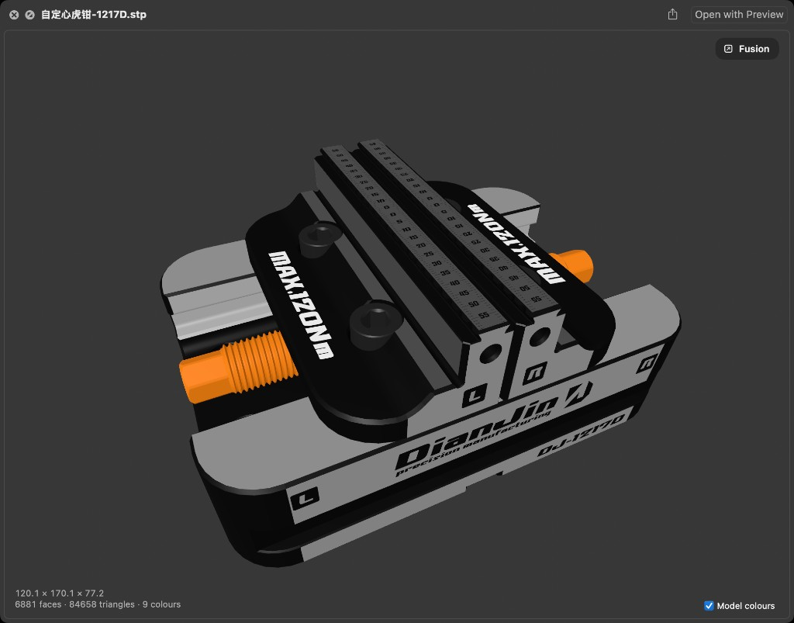
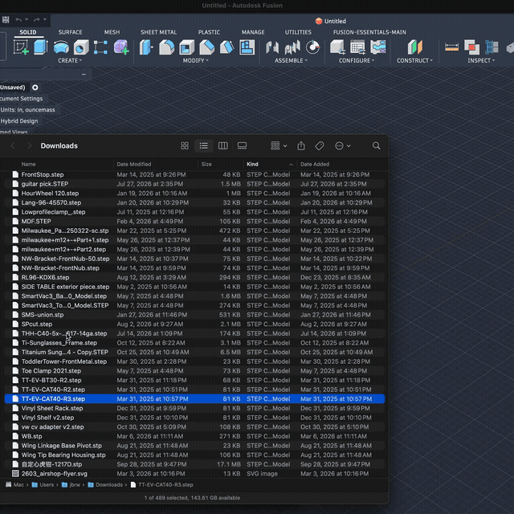

# Mac CAD Preview



Preview CAD models in the Finder by pressing the spacebar, the same way you
already preview images and PDFs.

macOS has no idea what a STEP file is. Select one in the Finder, press space,
and you get a blank document icon. This adds a Quick Look extension that reads
the file, tessellates the real B-rep geometry, and shows an interactive 3D model
you can orbit, zoom and inspect without opening Fusion. Spacebar also
lists zip, RAR and 7z archives, and shows G-code and Markdown as text.

## Demo



▶ [Watch full demo (MP4)](docs/demo.mp4)

## Install

Needs an Apple Silicon Mac running macOS 12 or later. No Terminal, and nothing
else to install.

1. Download the `.dmg` from the
   [latest release](https://github.com/jbrewlet/mac-cad-preview/releases/latest).

2. Open it and drag **Mac CAD Preview** onto the Applications folder beside it.

3. Open your Applications folder and double click Mac CAD Preview. **macOS will
   refuse to open it**, saying it cannot check it for malicious software. That is
   expected — see below.

4. Open System Settings, go to **Privacy & Security**, and scroll down to
   **Security**. There is a message about Mac CAD Preview being blocked, with an
   **Open Anyway** button. Click it and enter your password.

5. The app opens and shows its version. Quit it. That launch is all macOS needed;
   previews work whether or not the app is running.

6. Select a `.step`, `.iges`, `.stl`, `.3mf`, `.nc`, `.tap`, `.md`, `.zip`,
   `.rar` or `.7z` file in the Finder and press the spacebar.

### Why macOS blocks it, and why step 4 matters

Apple charges 99 US dollars a year for the certificate that would let this open
without a warning. This is free software and does not have one, so macOS cannot
confirm who built it and asks you to confirm instead.

Step 4 is not optional. macOS quarantines anything downloaded from the internet,
and a quarantined app is not allowed to load its Quick Look extension, so the
spacebar will do nothing until you approve the app. Approving it is what lifts
the quarantine.

Everything in the download is compiled from the source in this repository. If
you would rather not take that on trust, [build it yourself](#building-it-yourself)
— the result is the same app, and a locally compiled one is never quarantined,
so it skips steps 3 and 4 entirely.

## Using it

| Action | Gesture |
|:-------|:--------|
| Orbit | Drag |
| Zoom | Scroll (toward the pointer by default; both that and the direction are in Settings) |
| Pan | Two finger drag, or right button drag |

The first view frames the tessellated part with a little space to the edge of
the panel, not the untrimmed NURBS hull — so a Rhino STEP file is not a speck
in a huge empty frame. Zoom moves the camera toward whatever is under the
pointer rather than the centre of the window, and rotation re-anchors on the
point you zoomed into, so you can dive into a specific feature and keep
turning around it.

Models are shown with Z pointing up, matching Fusion, SolidWorks and Inventor,
rather than SceneKit's default of Y up. That, the starting camera and whether
zoom follows the pointer are all in Settings.

The bottom left corner shows the bounding box dimensions, the face count and the
triangle count. Click the dimensions to copy them. When a model has more than
one colour, a **Model colours** checkbox appears in the bottom right. Switch it
off to see the whole part in a single neutral finish, which is often easier to
read shape from. It is hidden for single colour models, where it would do
nothing. Whether it starts checked is a setting; the default is on.

**Edges** draws the sharp and boundary edges on top of the shaded model, the
usual CAD inspection look. **Ortho** switches the camera to an orthographic
projection. Both are settings; edges start on, perspective is the default.

Every preview has a **Settings** link. It opens the host app to the same
window as **Settings…** (⌘,) in Mac CAD Preview. Scroll up still zooms in
unless you invert it.

On STEP and IGES files, a **Fusion** button appears top-right when Autodesk
Fusion is installed. Click it to open the file in Fusion without leaving the
preview.

G-code (`.nc`, `.tap`) is shown as highlighted text rather than a 3D toolpath.
G and M words, axis addresses, feed and speed, tools and comments are coloured
so a program is readable at a glance. **A−** and **A+** in the corner change
the font size; the choice is saved. Line wrapping and the colour theme are
in **Settings**, with the font size.

Markdown (`.md`, `.markdown`) is shown as a rendered document by default.
**Rendered** / **Source** in the corner switches to the original text, and
**Settings** chooses which one a new preview starts on. **A−** and **A+**
change the font size for that preview, separately from G-code.

Zip, RAR and 7z archives are shown as a file listing: folders, names and
uncompressed sizes, without extracting anything. **A−** and **A+** change
the listing font size, saved separately from Markdown and G-code. A `.3mf`
file is still a 3D preview, not a zip listing, even though the format is
a zip under the hood.

The first preview of a large file can take a few seconds. The panel says
whether it is parsing or tessellating, and warns when the file is large enough
that the wait is real. Every preview of that same file afterwards is instant,
because the result is cached.

## Supported formats

| Format | Extensions | Colours |
|:-------|:-----------|:--------|
| STEP | `.step`, `.stp`, `.p21` | yes |
| IGES | `.iges`, `.igs` | yes |
| STL | `.stl` | no (the format has none) |
| 3MF | `.3mf` | no (basic mesh support) |
| G-code | `.nc`, `.tap` | syntax highlighting (text, not a mesh) |
| Markdown | `.md`, `.markdown` | rendered CommonMark, or the original source |
| Archive | `.zip`, `.rar`, `.7z` | file listing (names and sizes, nothing extracted) |

Model colours are read from the file where the exporter wrote them. Not every
exporter writes them, so a part with no colour data falls back to neutral grey.

## Updating

Download the new `.dmg` and drag the app across, replacing the copy in
Applications. Then open it once, as in step 4 above — a fresh download is
quarantined like any other, so it needs approving again.

To see which version you have, open Mac CAD Preview from your Applications
folder — the version is on the window. [CHANGELOG.md](CHANGELOG.md) records what
changed in each release.

## Uninstall

```bash
rm -rf "/Applications/Mac CAD Preview.app"
rm -rf ~/Library/Containers/com.maccadpreview.quicklook
```

macOS removes the extension registration when the containing app goes away.

## If something is wrong

Run this first. It prints each problem and the command that fixes it:

```bash
./doctor.sh yourpart.step
```

From a clone, or download `doctor.sh` from the repo and run it the same way.
It is read-only.

**Nothing happens, or the preview is blank.** Usually one of these:

1. The app is still quarantined (install step 4). Double click it, then
   approve it under System Settings → Privacy & Security → Open Anyway.
   Opening it once is also what registers the extension.

2. The Quick Look extension is off. System Settings → General → Login Items
   & Extensions → Quick Look, and enable Mac CAD Preview.

3. Another app has claimed the file type. Quick Look routes on the type
   macOS assigned, not the filename. `doctor.sh` names the type and the app.
   If it is one we do not handle yet, open an issue with that line.

To confirm macOS can see the extension:

```bash
pluginkit -m -i com.maccadpreview.quicklook
```

A leading `+` means it is registered and enabled. A blank first column can
still be registered. Nothing at all means it is not registered, which is the
quarantine case above. To clear the quarantine directly:

```bash
xattr -dr com.apple.quarantine "/Applications/Mac CAD Preview.app"
open "/Applications/Mac CAD Preview.app"
```

If you moved the app after installing it, macOS may still be pointing at the old
location:

```bash
/System/Library/Frameworks/CoreServices.framework/Frameworks/LaunchServices.framework/Support/lsregister -f "/Applications/Mac CAD Preview.app"
```

**One particular file will not open.** Some CAD tools write compressed data into
a plain `.step` file, which is not yet handled. Check with:

```bash
file yourpart.step
```

If it reports `gzip compressed data`, that is the known limitation below.

**Anything else.** The extension writes to the system log:

```bash
/usr/bin/log stream --level info --predicate 'subsystem == "com.maccadpreview"'
```

## Known limitations

* gzip compressed STEP files are rejected rather than decompressed.
* No Finder icon thumbnails yet. Files still show a generic icon in icon view;
  the preview only appears on spacebar.
* No OBJ or PLY support yet.
* G-code is a highlighted text preview, not a 3D toolpath.
* Archive preview is a listing only. Encrypted headers (some RAR files)
  cannot be listed without a password.
* Apple Silicon only. Intel is not supported.

## Support

This is free and always will be. If it saved you from opening Fusion just to
look at a part, you can [buy me a coffee](https://buymeacoffee.com/jbrw).

---

The rest of this is for people who want to build it themselves or understand how
it works.

## Building it yourself

An app you compiled is never quarantined, so building skips the Gatekeeper
approval the download needs. One command does the lot — it checks your Mac is
supported, installs [Homebrew](https://brew.sh) and OpenCASCADE if they are
missing, builds the newest release, and installs it:

```bash
curl -fsSLO https://raw.githubusercontent.com/jbrewlet/mac-cad-preview/main/install.sh
less install.sh    # read it before running it; q to quit
bash install.sh
```

Pass `--ref main` to build the latest development revision instead of the newest
release, or `--yes` to skip the prompt before Homebrew is installed. Expect it to
take several minutes, nearly all of it downloading OpenCASCADE.

By hand, if you prefer:

```bash
xcode-select --install          # Command Line Tools; Xcode is not required
brew install opencascade
git clone https://github.com/jbrewlet/mac-cad-preview.git
cd mac-cad-preview
git checkout "$(git tag -l 'v*' --sort=-v:refname | head -n 1)"
./build.sh
```

Omit the `git checkout` to build the latest development revision instead of the
most recent release.

The build produces `build/Mac CAD Preview.app`. Move it where it should live,
then launch it once to register the extension:

```bash
mv "build/Mac CAD Preview.app" /Applications/
open "/Applications/Mac CAD Preview.app"
```

To check what a built bundle reports as its version:

```bash
/usr/libexec/PlistBuddy -c 'Print :CFBundleShortVersionString' \
    "/Applications/Mac CAD Preview.app/Contents/Info.plist"
```

[RELEASING.md](RELEASING.md) covers cutting a release. `./doctor.sh` diagnoses
a preview that does not appear. `tests/` holds one model per supported format,
and `tests/README.md` describes what each covers.

### Packaging a release

`./package.sh` builds the app and wraps it in `build/MacCADPreview-<version>.dmg`,
alongside a link to Applications and the install instructions. It prints the
image's SHA-256, which goes in the release notes so the download can be checked.

The app bundle is self contained — `build.sh` copies all 30 OpenCASCADE dylibs
into it and rewrites their load paths — so the image runs on a Mac with no
Homebrew, no Command Line Tools and nothing else installed. It is 16 MB
compressed.

### Signing

There is no Apple Developer ID behind this project, so both bundles are ad-hoc
signed. That is enough for macOS to run them, but not enough for Gatekeeper to
vouch for them, which is why a downloaded copy has to be approved once in
System Settings before its Quick Look extension will load. A locally compiled
copy is never quarantined and needs no approval.

The extension is signed with its own entitlements rather than with
`codesign --deep`, and it keeps `com.apple.security.app-sandbox`. Both matter:
PlugInKit silently refuses to register a Quick Look extension that is not
sandboxed, and `--deep` would flatten the entitlements of everything it touches.

## Formats and tessellation

STEP and IGES are boundary representation formats: they describe trimmed NURBS
surfaces rather than triangles, so they have to be tessellated before anything
can draw them. That work is done by [OpenCASCADE](https://dev.opencascade.org).

STEP stores colours as `styled_item` entities, and they can be attached to a
whole solid or to an individual face. Triangles are grouped by colour and drawn
one draw call per group.

## Performance

Reading a STEP file is slow, and the cost is in parsing the text rather than in
meshing the geometry. A 56 MB assembly takes about 19 seconds. Lowering the
tessellation quality does not help, because that is not where the time goes.

So the tessellated result is cached. The first preview of a file pays the full
cost, and every preview after that is instant:

```
RC Draft.step (8.2 MB, 96,808 triangles)
  first open   3.15 s
  thereafter   0.00 s
```

The cache lives in the extension's sandbox container:

```
~/Library/Containers/com.maccadpreview.quicklook/Data/Library/Caches/MacCADPreview/
```

Settings are a plist in the same container, under
`Application Support/MacCADPreview/`. The host app is not sandboxed, so it
writes that file directly. There is no Developer ID, which is why this is not
an App Group. The preview **Settings** link asks the unsandboxed XPC helper
to open `maccadpreview://settings`.

Entries are keyed on file path, size and modification time, so re-exporting a
part from your CAD tool invalidates the old entry automatically. The cache is
capped at 512 MB and evicts the least recently used entries first. To clear it:

```bash
rm -rf ~/Library/Containers/com.maccadpreview.quicklook/Data/Library/Caches/MacCADPreview
```

## How it works

`build.sh` assembles two bundles by hand, with no Xcode project involved:

* `Mac CAD Preview.app`, a container app whose only job is to be somewhere macOS
  can find the extension.
* `MacCADPreviewQL.appex` inside it, a Quick Look preview extension. Its entry
  point is `NSExtensionMain` rather than `main`.

The geometry core is C++ over OpenCASCADE, exposed to Swift through a small C
API (`src/core/cadmesh.h`). It reads the file, tessellates it, groups triangles
by colour, and returns flat buffers that become SceneKit geometry, one draw call
per colour.

Quick Look extensions are sandboxed and cannot load libraries from
`/opt/homebrew`, so `build.sh` copies every OpenCASCADE dylib the extension
needs into the bundle and rewrites the load commands to point inside it. That is
30 libraries and about 38 MB, walked automatically from the dependency graph.

Quick Look also kills extensions that take too long to respond, which a 19 second
parse would trip. So the panel is put on screen and reported ready immediately,
and the geometry is filled in from a background queue when it is available.

G-code files skip the geometry core. The extension reads the text, colours
word-address codes and comments, and shows that in a scrollable view. Files
larger than 1 MB are truncated so a long CAM program cannot stall the panel.

Markdown files use the same text panel. Foundation parses CommonMark into
attributed text for the rendered view; **Source** shows the file as written.
The default view is a setting, and the control on the panel writes the same
preference.

Zip, RAR and 7z files also use the text panel. The extension reads the
archive headers through the system libarchive and lists names and sizes;
it does not unpack members. Archives with more than 10,000 entries show
the start of the listing and note the rest.

## Licence

MIT. See [LICENSE](LICENSE).

### Third party

This project links against, and its built app bundles, the following libraries.
None of them are modified.

| Library | Licence |
|:--------|:--------|
| OpenCASCADE Technology | LGPL 2.1, with the Open CASCADE exception |
| FreeType | FreeType Licence (BSD style) |
| libpng | PNG Reference Library Licence |
| Intel oneTBB | Apache 2.0 |

The repository itself contains no third party code. Those libraries arrive via
Homebrew when you build, and are copied into the app bundle at that point. If
you redistribute a built app, rather than the source, you take on the notice
requirements of the licences above.
